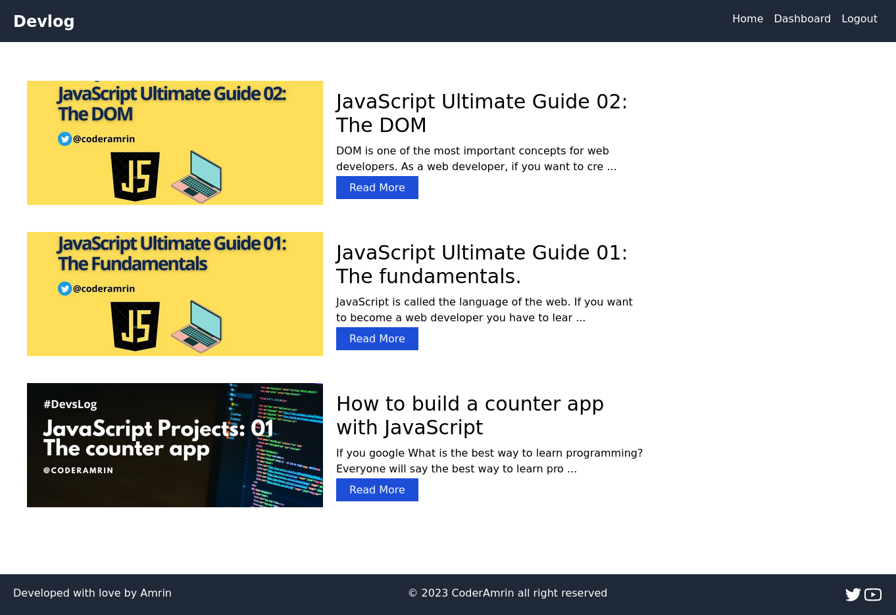
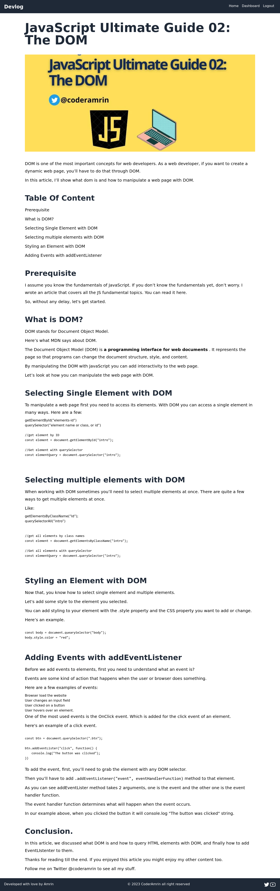
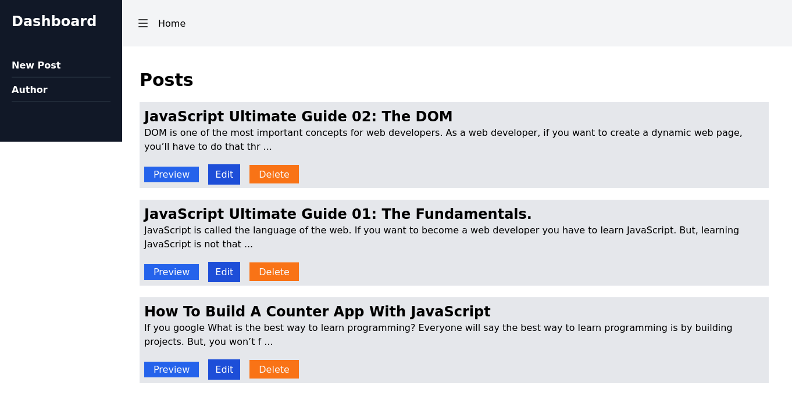

# Devlog

A Multi author blog application with MERN

### [Live Preview](https://devlogg.onrender.com/)

## Table Of Content:

## 1. [Backend](#backend)
- [End points](#endpoints)
- [Technologies used](#technologies-used)
- [Getting started](#getting-started)

## 2. [Frontend](#frontend)


---------------------

# Backend

## Endpoints

**Base URL** : https://devlog.onrender.com/

**User**

| Description      | Method | URL | 
| ----------- | ----------- |------
| Register      | POST       | /api/user/register
| Login      | POST       | /api/user/login
| Get curent user      | GET       | /api/user/loggedin


**Post**

| Description      | Method | URL | 
| ----------- | ----------- |------
| Get all posts      | GET       | /api/posts/
| Get all posts by current user    | GET       | /api/posts/my-posts
| Get a post by Id    | GET       | /api/posts/:id
| Add a new post      | POST       | /api/posts/new-post
| Edit a post    | PUT       | /api/posts/edit/:id
| Delete a post    | DELETE       | /api/posts/delete/:id
| Add a comment on a post    | POST       | /api/posts/:id/comment


**Coment**

| Description      | Method | URL | 
| ----------- | ----------- |------
| Add a comment on a post    | POST       | /api/posts/:id/comment
| Delete a comment on a post    | DELETE       | /api/posts/:id/:commentId/delete


## Technologies Used

- Node.js
- Express.js
- MongoDB
- MongoDB Atlas
- Mongoose
- Jsonwebtoken


## Getting Started

**Clone the repo**

```
git clone https://github.com/Coderamrin/devlog.git
cd devlog
```

**Set up env file**
```
DB_URL=[DB url to connect the database with the server]
PORT=[developement port]
JWT_SECRET=[jasonwebtoken secret for token]
```

**Install and start**

```
npm i
npm run server
or
npm run start
```


## Frontend


## Project Preview






